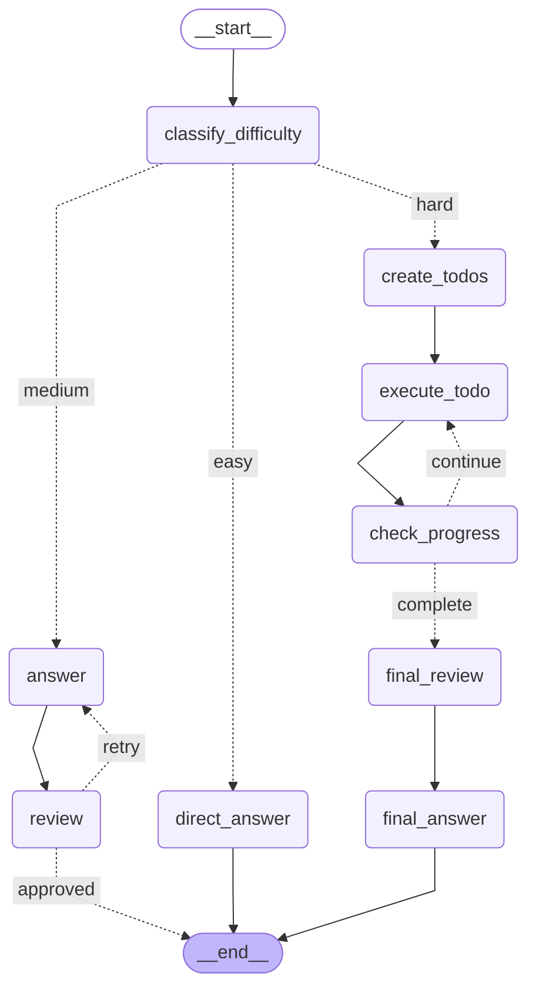

# AutonomousGraph Mermaid Diagram

```mermaid
---
config:
  flowchart:
    curve: linear
---
graph TD;
	__start__([<p>__start__</p>]):::first
	classify_difficulty(classify_difficulty)
	direct_answer(direct_answer)
	answer(answer)
	review(review)
	create_todos(create_todos)
	execute_todo(execute_todo)
	check_progress(check_progress)
	final_review(final_review)
	final_answer(final_answer)
	__end__([<p>__end__</p>]):::last
	__start__ --> classify_difficulty;
	answer --> review;
	check_progress -. &nbsp;continue&nbsp; .-> execute_todo;
	check_progress -. &nbsp;complete&nbsp; .-> final_review;
	classify_difficulty -. &nbsp;medium&nbsp; .-> answer;
	classify_difficulty -. &nbsp;hard&nbsp; .-> create_todos;
	classify_difficulty -. &nbsp;easy&nbsp; .-> direct_answer;
	create_todos --> execute_todo;
	execute_todo --> check_progress;
	final_review --> final_answer;
	review -. &nbsp;approved&nbsp; .-> __end__;
	review -. &nbsp;retry&nbsp; .-> answer;
	direct_answer --> __end__;
	final_answer --> __end__;
	classDef default fill:#f2f0ff,line-height:1.2
	classDef first fill-opacity:0
	classDef last fill:#bfb6fc

```
